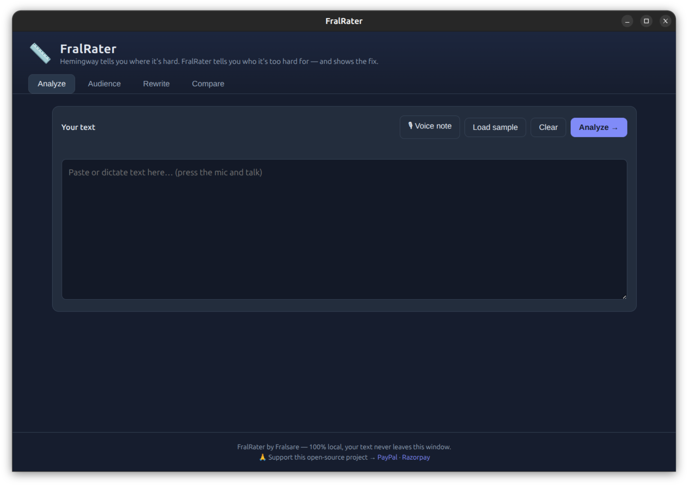
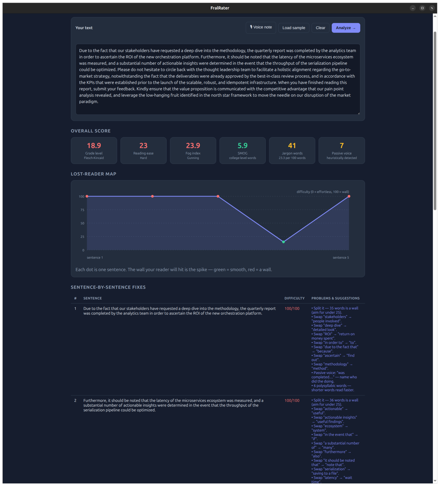
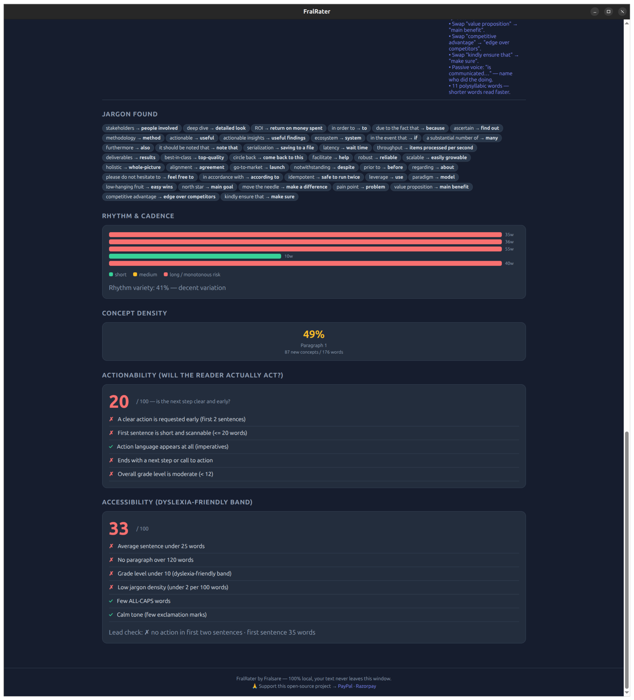
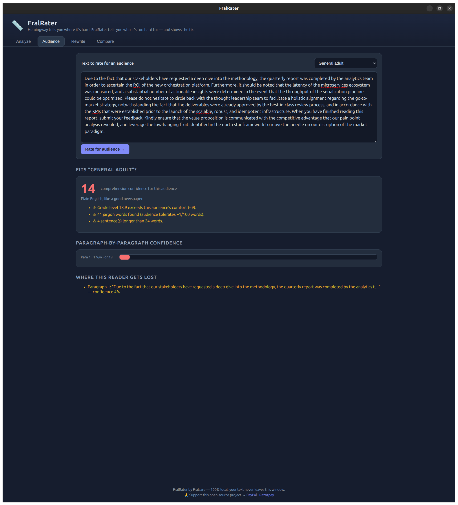
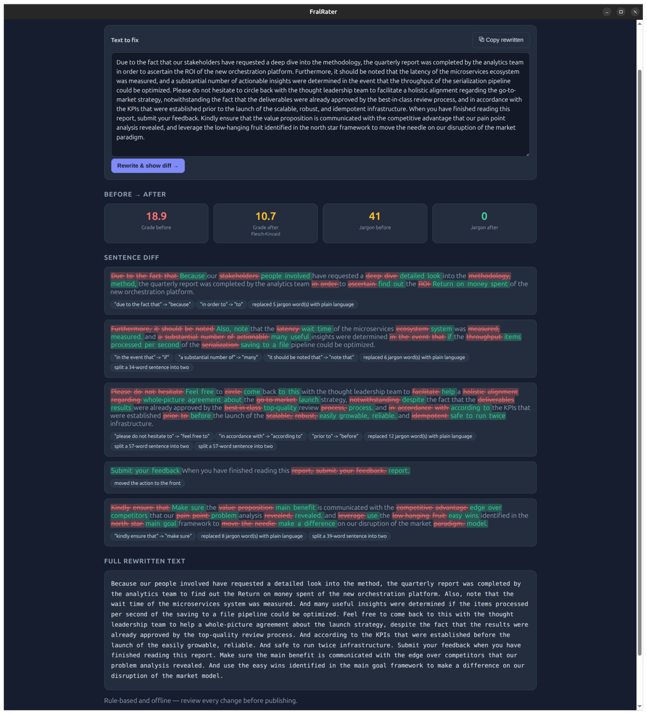
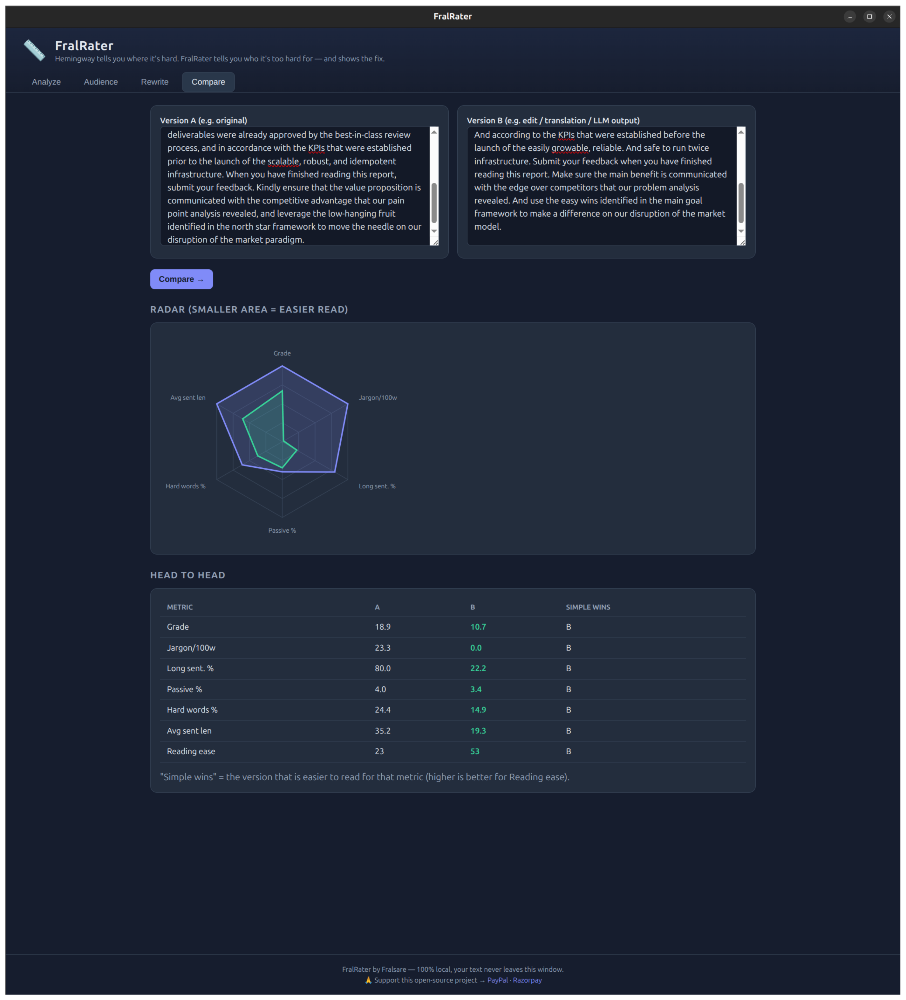

# FralRater — User Manual

FralRater tells you **who** your writing is too hard for — and shows you the
fix. Unlike score-only tools, it scores your text for specific reader
personas, maps exactly where readers get lost, and rewrites the hard parts
right in front of you. Everything runs locally: your text never leaves your
machine.

---

## 1. Getting Started

### Install

| Platform  | What to use | How |
|-----------|-------------|-----|
| Linux (GNOME/KDE/etc.) | `FralRater-x.y.z.AppImage` | Make it executable, then run it |
| Linux (Debian/Ubuntu) | `fralrater_x.y.z_amd64.deb` | Double-click or `sudo dpkg -i fralrater_*.deb` |
| Linux (Fedora/RHEL/openSUSE) | `fralrater-x.y.z-1.x86_64.rpm` | Double-click or `sudo rpm -i fralrater-*.rpm` |
| Windows | `FralRater Setup x.y.z.exe` | Run the installer |
| Windows (no install) | `FralRater-portable-x.y.z-win-x64.zip` | Unzip anywhere, run the `FralRater.exe` inside |

**Linux — first run for each format**

```bash
# AppImage
chmod +x FralRater-*.AppImage
./FralRater-*.AppImage

# .deb
sudo dpkg -i fralrater_*.deb

# .rpm
sudo rpm -i fralrater-*.rpm
```

After installing, launch **FralRater** from your application menu. The window
opens by itself — no browser, no setup. The app starts its own private local
server on a free port and shuts it down when you close the window.

### First window

The app has four tabs across the top: **Analyze**, **Audience**, **Rewrite**,
**Compare**. There are two quick buttons above the text areas:

- **Load sample** — fills the input with a dense, jargon-y corporate paragraph
  so you can see everything working in one click.
- **🎙 Voice note** — dictate into the Analyze box (see Section 6).
- **Clear** — empties all text boxes.



---

## 2. Analyze

Paste (or type) text into the box and press **Analyze**. You get:

- **Big score** — Flesch-Kincaid grade level with a traffic-light color
  (green = easy, yellow = moderate, red = hard).
- **Metric cards** — Reading ease, Gunning fog, SMOG, jargon per 100 words,
  long-sentence %, passive-voice %, hard-word %.
- **Lost Reader map** — a curve where each point is one sentence. The higher
  the point, the harder that sentence is. Peaks are where readers disengage.
- **Jargon findings** — the exact jargon words detected (e.g. *leverage,
  synergize, operationalize*) with human-friendly counts.
- **Actionability** — whether the text tells the reader what to *do* next,
  not just what to know.
- **Accessibility** — flags for jargon-heavy and passive-heavy passages.

Use **Load sample** if you want a 5-second demo.





## 3. Audience

Pick one of 8 reader personas and press **Score for audience**:

| Persona | Who they are |
|---------|--------------|
| Child (8) | Young reader, short attention |
| General public | Everyday news/social reader |
| Professional | Working adult, busy |
| Executive | Skims for the bottom line |
| Patient | Non-expert reading medical/admin text |
| Developer | Comfortable with code, allergic to fluff |
| Legal | Precision-focused |
| Academic | Expectation of depth and terminology |

You get a 0–100 fit score, a verdict, and **per-paragraph confidence bars** so
you can see exactly which paragraphs fail for that audience.



## 4. Rewrite

Paste text and press **Rewrite**. The rewriter is rule-based, offline, and
deterministic (no AI, no cloud). It performs:

1. **Passive → active flip** — "The data was analyzed by the team" →
   "The team analyzed the data" (only when the agent is unambiguous).
2. **Buried-lead fix** — "When you finish the form, submit it" →
   "Submit it when you finish the form".
3. **Jargon swaps** — *utilize → use*, *leverage → use*, *commence → start*,
   etc., with a per-100-word density meter before/after.
4. **Long-sentence splitting** — sentences over the limit are cut at safe
   clause boundaries.

Results you can read at a glance:

- **Before → After** grade cards (Flesch-Kincaid, jargon count).
- **Sentence diff** — each changed sentence with old/new text, deleted and
  inserted words highlighted, and chips naming which fixes were applied.
- **Full rewritten text** — wraps inside its box, with a **Copy** button
  above to put it on your clipboard.

Always review the diff before publishing: the rewriter is deliberately
conservative.



## 5. Compare

Paste version A and version B (draft vs edit, human vs LLM, original vs
translation) and press **Compare**. You get a **radar chart** (smaller area =
easier read) and a **head-to-head table** where the winning cell is green
for each metric.



## 6. Voice Note (Speech-to-Text)

1. Click **🎙 Voice note** in the Analyze tab.
2. Allow the microphone when your OS asks.
3. Speak; the words appear live in the text box. Click again to stop.

> **Availability:** the Web Speech API is provided by Google and is built
> into **Chrome / Chromium / Edge (Chromium)** on Windows. It is **not
> available in Electron on Linux**, so in the Linux desktop app this button
> shows a status message instead. TTS (read-aloud) is not part of this
> release.

## 7. Right-Click Menus (Desktop App)

In the desktop app you can right-click inside any text box for
**Undo / Redo / Cut / Copy / Paste / Delete / Select All**, and right-click on
selected text to **Copy**. This mirrors Ctrl+V and friends.

## 8. Keyboard Shortcuts

| Key | Action |
|-----|--------|
| Ctrl/⌘ + C | Copy selection |
| Ctrl/⌘ + V | Paste |
| Ctrl/⌘ + X | Cut (in text boxes) |
| Ctrl/⌘ + Z / Y | Undo / Redo |
| Ctrl/⌘ + A | Select all (in the focused text box) |
| Right-click | Context menu |

## 9. Privacy

- **No network calls.** The app never phones home.
- Your text is processed in the local server + browser and is discarded when
  you close the window.
- Voice notes are handled by the Web Speech API of the underlying browser
  engine.

## 10. Troubleshooting

| Symptom | Fix |
|---------|-----|
| AppImage won't start on Linux | `chmod +x` the file. If the distro blocks AppImages, use the `.deb` or `.rpm`, or run `--appimage-extract-and-run`. |
| `.deb`/`.rpm` install fails | You're on a different distro family — use the format that matches (deb = Debian/Ubuntu, rpm = Fedora/RHEL/openSUSE). |
| Windows SmartScreen warns | "More info" → "Run anyway" — the app is unsigned. |
| Window flashes and closes (dev) | Run `npm start` in a terminal to see the error. |
| Voice note button says "not available" | Expected on Linux desktop — see Section 6. Use Chrome, or type/paste instead. |
| High CPU at launch | One-time font/cache warm-up of the local server; it settles. |

## 11. Support & Donation

🙏 **Support open-source tool development**
Your donation keeps this project maintained and funds new open-source
projects, while supporting my CyberSecurity studies. Even a small amount makes
a real difference. Thank you for supporting independent open-source work!

| Method | Link |
|--------|------|
| PayPal | <https://paypal.com/ncp/payment/KKFBWQP97XUCN> |
| Razorpay | <https://rzp.io/rzp/TdksERz> |

## 12. Building from Source (optional)

```bash
npm install
npm start                 # run from source

npm run package:linux     # AppImage + .deb + .rpm   (needs `sudo apt-get install rpm` for the .rpm)
npm run package:win       # NSIS installer .exe      (on Linux needs `sudo apt-get install wine64`)
npm run package:portable  # portable .zip (works on Linux without Wine)
npm run package:all       # everything
```

All output lands in `dist/`.

## 13. Project Links

- Repository: <https://github.com/fralsare/fralrater>
- License: [MIT](LICENSE)
- Code of Conduct: [CODE_OF_CONDUCT.md](CODE_OF_CONDUCT.md)
- Changelog: [CHANGELOG.md](CHANGELOG.md)
